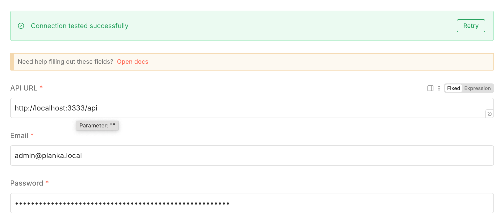

# n8n-nodes-planka

[](https://badge.fury.io/js/@borgius%2Fn8n-nodes-planka)
[](https://opensource.org/licenses/MIT)

n8n community node for [Planka](https://planka.app/) - Open Source Project Management

## Features

- **Project Management**: Create, read, update, and delete projects
- **Board Management**: Manage boards, lists, tags, and members
- **Card Management**: Handle cards, tasks, comments, and attachments
- **User Management**: User-related operations and permissions

## Installation

### Option 1: Install from npm
```bash
npm install @borgius/n8n-nodes-planka
```

### Option 2: Install from source
```bash
git clone https://github.com/TaiStudio/n8n-nodes-planka.git
cd n8n-nodes-planka
npm install
npm run build
```

## Authentication

This node uses **email/password** authentication against the Planka API (not API tokens).

### Credential Configuration

| Field      | Description                                          | Example                         |
|------------|------------------------------------------------------|---------------------------------|
| **API URL**  | Your Planka instance URL followed by `/api`        | `http://localhost:3333/api`     |
| **Email**    | The email address of your Planka account           | `admin@planka.local`            |
| **Password** | The password for your Planka account               | `••••••••`                      |

> **Important:** The API URL must include the `/api` suffix (e.g. `https://planka.example.com/api`).



## Usage

1. **Install the node** using one of the methods above
2. **Restart n8n** to load the new node
3. **Configure credentials** with your Planka API URL, email, and password (see above)
4. **Use the node** in your workflows with the available resources

## Compatibility

### Supported Planka Versions
- Planka 2.x (Recommended)
- Planka 1.x (Legacy support)

## Available Operations

### Project Resource
- `getAll`: List all projects
- `get`: Get a specific project
- `create`: Create a new project
- `update`: Update an existing project
- `delete`: Delete a project

### Board Resource
- `getAll`: List all boards in a project
- `get`: Get a specific board
- `create`: Create a new board
- `update`: Update an existing board
- `delete`: Delete a board

### Card Resource
- `getAll`: List all cards in a list
- `get`: Get a specific card
- `create`: Create a new card
- `update`: Update an existing card
- `delete`: Delete a card
- `addComment`: Add a comment to a card
- `addAttachment`: Add an attachment to a card

### User Resource
- `getAll`: List all users
- `get`: Get a specific user
- `getCurrent`: Get current user information

## Troubleshooting

### Common Issues

1. **Authentication Errors (404 / E_NOT_FOUND)**
   - Make sure your API URL ends with `/api` (e.g. `http://localhost:3333/api`)
   - Verify your email and password are correct
   - Check that your Planka instance is running and accessible

2. **Connection Issues**
   - Verify network connectivity to your Planka instance
   - Check if there are any firewall restrictions
   - Ensure HTTPS is properly configured if using SSL

## Contributing

Contributions are welcome! Please feel free to submit a Pull Request.

## License

This project is licensed under the MIT License - see the [LICENSE](LICENSE) file for details.

## Links

- [n8n](https://n8n.io/)
- [Planka](https://planka.app/)
- [Planka GitHub](https://github.com/plankanban/planka)

---

**Note**: This is a community-maintained node and is not officially supported by the n8n or Planka teams.
